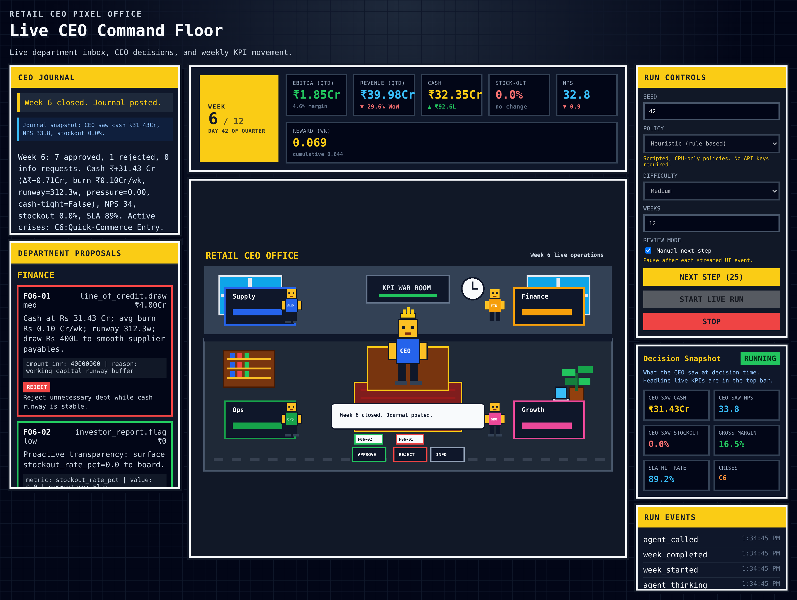

# RetailCEO-Bench

[](https://github.com/hiteshK03/retailceo-bench/actions/workflows/ci.yml)
[](./LICENSE)
[](https://www.python.org/downloads/)

<p align="center">
  
</p>

<p align="center"><em>The live &quot;Pixel CEO Office&quot; dashboard — a scripted <code>RetailCEOEnv</code> episode streaming weekly KPIs, department proposals, and live CEO decisions.</em></p>

**Can LLMs run a retail chain profitably?**

RetailCEO-Bench tests how well large language models can operate as CEO of a
simulated tier-2 Indian retail chain over a 12-week quarter (or multi-year
horizon). Each week the model receives KPI reports, department proposals, crisis
alerts, and competitor intelligence, then makes approve / reject / modify /
request_info decisions that must keep the company profitable, solvent, and
growing.

It is **two things at once**:

1. **A benchmark** — a fixed, seed-pinned evaluation protocol for frontier and
   open-source models ([jump to Evaluation](#evaluation)).
2. **An RL training environment** — an [OpenEnv](https://github.com/meta-pytorch/OpenEnv)
   server that any RL framework can drive, with a strict train/eval seed split
   so training cannot leak the benchmark ([jump to RL Training](#rl-training-environment-openenv)).

---

## Table of Contents

- [Leaderboard](#leaderboard)
- [Quickstart](#quickstart)
- [Evaluation](#evaluation)
  - [Configuration reference](#configuration-reference)
  - [Evaluation protocol](#evaluation-protocol)
  - [Submission rules](#submission-rules)
- [RL Training Environment (OpenEnv)](#rl-training-environment-openenv)
  - [Why training can't leak the benchmark](#why-training-cant-leak-the-benchmark)
  - [Running the env server](#running-the-env-server)
  - [Driving it from a trainer](#driving-it-from-a-trainer)
- [How It Works](#how-it-works)
- [Reward](#reward)
- [Project Structure](#project-structure)
- [Live Office Demo](#live-office-demo)
- [Glossary](#glossary)
- [Roadmap](#roadmap)
- [Contributing](#contributing)
- [Known Limitations](#known-limitations)
- [License](#license)

---

## Leaderboard

Full protocol: 10 seeds × 3 difficulties. Ranked by **Weighted** score —
a difficulty-weighted mean `(1·easy + 2·medium + 3·hard) / 6` that counts the
adversarial hard regime most, since easy barely separates policies. Higher is
better.

| Policy | Easy | Medium | Hard | Weighted |
|--------|------|--------|------|----------|
| Oracle (ceiling) | +2.01 | +1.60 | +0.32 | +1.03 |
| Heuristic (19 rules) | +2.01 | +1.60 | +0.24 | +0.99 |
| **Claude Opus 4.6** | +1.59 | +1.10 | +0.27 | +0.77 |
| **Claude Sonnet 4.6** | +1.55 | +1.06 | +0.25 | +0.74 |
| All-Approve | +2.08 | +1.32 | -0.17 | +0.70 |
| Random | +0.42 | -0.27 | -1.37 | -0.71 |

> All rows are under the corrected reward (10 seeds × 3 difficulties). Frontier
> models still **underperform the hand-crafted Heuristic baseline** — closing
> that gap is the benchmark's core challenge. The weighting is what surfaces the
> real ordering: on a plain average, mindless All-Approve outranks both frontier
> models (easy/medium reward blind approval), but it collapses on hard (-0.17)
> where the models hold positive — so the hard-weighted score ranks them
> correctly. The **Oracle** is a genuine ceiling above the heuristic (via
> horizon-aware capex foresight); see [docs/CALIBRATION.md](./docs/CALIBRATION.md)
> for the reward-design analysis.
>
> **Run config:** frontier rows used `--permissive`, temperature 0, and no
> parse retries. Reproduce the ranking with
> `python -m eval.cli leaderboard results/*.json`; full per-seed traces are in
> `results/opus4_full.json` / `results/sonnet4_full.json`.

<details>
<summary>Extended metrics (click to expand)</summary>

| Policy | Difficulty | Reward | EBITDA% | Stockout% | NPS | FCF (Cr) |
|--------|-----------|--------|---------|-----------|-----|----------|
| Oracle | Easy | +2.01 | +10.50 | 1.9 | 34.3 | +36.5 |
| Oracle | Medium | +1.60 | +6.02 | 1.1 | 34.0 | +37.0 |
| Oracle | Hard | +0.32 | +1.62 | 1.1 | 32.8 | +29.0 |
| Heuristic | Easy | +2.01 | +10.55 | 1.9 | 34.3 | +36.4 |
| Heuristic | Medium | +1.60 | +6.00 | 1.1 | 34.0 | +36.8 |
| Heuristic | Hard | +0.24 | +1.06 | 1.2 | 32.7 | +27.9 |
| All-Approve | Easy | +2.08 | +7.62 | 4.2 | 33.1 | +49.2 |
| All-Approve | Medium | +1.32 | +2.78 | 4.5 | 31.7 | +42.0 |
| All-Approve | Hard | -0.17 | -5.86 | 5.0 | 31.1 | +28.0 |
| Opus 4.6 | Easy | +1.59 | +9.67 | 7.7 | 28.6 | +24.2 |
| Opus 4.6 | Medium | +1.10 | +4.84 | 6.4 | 29.5 | +20.9 |
| Opus 4.6 | Hard | +0.27 | +0.61 | 4.7 | 31.0 | +15.8 |
| Sonnet 4.6 | Easy | +1.55 | +9.69 | 7.4 | 28.7 | +21.7 |
| Sonnet 4.6 | Medium | +1.06 | +4.67 | 6.7 | 28.8 | +20.3 |
| Sonnet 4.6 | Hard | +0.25 | +0.48 | 3.9 | 31.7 | +14.1 |
| Random | Easy | +0.42 | +4.87 | 19.2 | 14.2 | +45.0 |
| Random | Medium | -0.27 | -0.83 | 17.6 | 17.3 | +38.0 |
| Random | Hard | -1.37 | -6.99 | 18.1 | 14.6 | +33.6 |

</details>

> All rows are under the corrected reward (see [Reward](#reward)). Baselines
> reproduce with `python -m eval.cli baselines --protocol full`; frontier rows
> with `python -m eval.cli frontier --model <model> --protocol full`. Adding
> more models is welcome as PRs.

---

## Quickstart

### Installation

```bash
pip install -e .                  # core simulator only (pydantic)
pip install -e ".[eval]"          # + anthropic/openai for frontier eval
pip install -e ".[openenv]"       # + openenv for the RL training env
pip install -e ".[dev]"           # + pytest for development
```

Requires Python >= 3.10. Extras combine, e.g. `pip install -e ".[dev,eval,openenv]"`.

### Run baselines

> **CLI note:** global flags (`--difficulty`, `--weeks`, …) go **before** the
> subcommand (`baselines` / `frontier` / `trace` / `compare`).

```bash
python -m eval.cli --difficulty medium --weeks 12 baselines --seeds 42 43 44 45 46
```

### Run a frontier model

```bash
export ANTHROPIC_API_KEY=sk-...
python -m eval.cli --difficulty easy frontier --model claude-sonnet-4-5 --seeds 42 43 44
```

### Single-episode trace

```bash
python -m eval.cli --difficulty medium trace --policy heuristic --seed 42 --out trace.json
```

### Python API

```python
from retailceo.models import BenchmarkConfig, CEOAction, ProposalDecision
from retailceo.environment import RetailCEOEnv

env = RetailCEOEnv(BenchmarkConfig(difficulty="medium", weeks_per_quarter=12))
obs = env.reset(seed=42)

while not obs.done:
    decisions = [
        ProposalDecision(proposal_id=p.proposal_id, verdict="approve")
        for p in obs.inbox
    ]
    obs = env.step(CEOAction(action_type="decide", decisions=decisions))

print(f"Total reward: {sum(w.weekly_reward for w in env.state.history):.2f}")
```

---

## Evaluation

The `eval` CLI has four subcommands: `baselines`, `frontier`, `trace`,
`compare`.

### Configuration reference

**Global flags** (before the subcommand):

| Flag | Default | Description |
|------|---------|-------------|
| `--difficulty` | `medium` | `easy` \| `medium` \| `hard` — controls department drift, COGS, growth-lever strength |
| `--weeks` | `12` | Episode length in weeks (one quarter) |
| `--years` | `0` | Multi-year horizon (`1`/`3`/`5`); overrides `--weeks` when set |
| `--crisis-prob` | `0.85` | Probability each crisis type fires |
| `--starting-cash` | `2e8` | Starting cash in INR (₹20 Cr) |
| `--verbose` / `--quiet` | off | Per-week trace / suppress per-seed logs |

**`frontier` flags:**

| Flag | Default | Description |
|------|---------|-------------|
| `--model` | provider default | Model id (e.g. `claude-sonnet-4-5`, `gpt-4o`) |
| `--provider` | `auto` | `auto` \| `anthropic` \| `openai` (auto-inferred from model/keys) |
| `--api-base` | none | OpenAI-compatible base URL — point at **any** vLLM / OpenRouter / self-hosted OSS endpoint |
| `--temperature` | `0.0` | Greedy decoding for official runs |
| `--max-tokens` | `4096` | Output token budget |
| `--parse-retries` | `0` | Re-prompt attempts on unparseable output. **`0` = official protocol.** Set `>0` only for exploratory runs |
| `--protocol` | none | `lite` \| `full` — standardized tiers (override `--seeds`/`--difficulty`) |
| `--out` | none | Write result JSON |

**Open-source / self-hosted models** work through the OpenAI-compatible path —
no code changes needed:

```bash
python -m eval.cli frontier \
  --provider openai \
  --api-base http://localhost:8000/v1 \
  --model Qwen/Qwen2.5-7B-Instruct \
  --protocol lite
```

**Provider auth env vars:** `ANTHROPIC_API_KEY`, `OPENAI_API_KEY`,
optionally `ANTHROPIC_BASE_URL` and `ANTHROPIC_CUSTOM_HEADERS`
(`"Key: Val, Key2: Val2"`).

### Evaluation protocol

Two tiers, selected with `--protocol`:

| Tier | Seeds | Difficulties | Weeks | ~LLM calls |
|------|-------|--------------|-------|-----------|
| **lite** | 42–46 (5) | medium | 12 | ~50 |
| **full** | 42–51 (10) | easy, medium, hard | 12 | ~150 |

```bash
python -m eval.cli frontier --model <model> --protocol lite
python -m eval.cli frontier --model <model> --protocol full --out results/<model>_full.json
```

### Submission rules

1. **Temperature 0.0** (greedy decoding).
2. **No parse retries** — `--parse-retries 0` (the default). If the model
   emits unparseable output, the environment falls back to `request_info` for
   every proposal (a no-op); do not retry.
3. **Default system prompt** from `retailceo/prompts.py` — no custom prompts or
   few-shot examples.
4. **Submit full trace JSONs** for independent verification.

---

## RL Training Environment (OpenEnv)

`retailceo_env/` wraps the simulator as a framework-agnostic
[OpenEnv](https://github.com/meta-pytorch/OpenEnv) environment. Start the
server, connect any RL trainer (torchforge, verl, TRL, your own loop) as an
HTTP/WebSocket client — the same simulator, reward, and parser the benchmark
uses.

The action is **text-native**: the agent returns the raw completion it would
produce for the weekly brief, and the environment parses it internally with the
benchmark's own parser. So a policy trained here faces an identical contract to
the benchmark.

### Why training can't leak the benchmark

This is the core design constraint. **In this benchmark a seed *is* a test
instance** — it deterministically fixes the crisis schedule, proposal stream,
department drift, and festival timing, i.e. the entire episode. The leaderboard
is scored on seeds **42–51**.

If training were allowed to `reset()` on those seeds, a policy could memorize
the exact eval episodes — train-on-test leakage, even though no dataset is
shared. The environment prevents this structurally:

- **Reserved eval seeds (42–51) are refused** for training by default. Passing
  one raises unless you explicitly set `allow_eval_seeds=True` (intended only
  for reproducing official numbers, never for training).
- **Unpinned resets draw from a disjoint training pool** (`seed >= 100000`).

Because the simulator is procedural, the training pool is effectively unlimited
and disjoint from eval. What's measured is **generalization** — does a policy
trained on training-pool seeds transfer to the held-out eval seeds? — not
memorization.

### Running the env server

```bash
pip install -e ".[openenv]"

# Local:
uvicorn retailceo_env.server.app:app --host 0.0.0.0 --port 8000

# Docker (build from the repo root so the retailceo/ core is in context):
docker build -f retailceo_env/server/Dockerfile -t retailceo-env:latest .
docker run -p 8000:8000 -e RETAILCEO_DIFFICULTY=hard retailceo-env:latest
```

**Server env vars:**

| Variable | Default | Description |
|----------|---------|-------------|
| `RETAILCEO_DIFFICULTY` | `medium` | `easy` \| `medium` \| `hard` |
| `RETAILCEO_WEEKS` | `12` | Episode length |
| `RETAILCEO_YEARS` | `0` | Multi-year horizon (overrides weeks) |
| `RETAILCEO_CRISIS_PROB` | `0.85` | Per-crisis fire probability |
| `RETAILCEO_START_CASH` | `2e8` | Starting cash (INR) |
| `RETAILCEO_ALLOW_EVAL_SEEDS` | `0` | `1` permits reserved seeds 42–51 (do **not** use for training) |

### Driving it from a trainer

```python
from retailceo_env import RetailCEOEnv, CEOTextAction

with RetailCEOEnv(base_url="http://localhost:8000") as env:
    result = env.reset(seed=123456)              # training-pool seed (>= 100000)
    while not result.done:
        prompt = result.observation.prompt       # feed to your model
        completion = my_model.generate(prompt)   # your policy
        result = env.step(CEOTextAction(completion=completion))
        reward = result.reward                   # per-week; terminal on last step
```

`result.observation` also surfaces read-only scalars (`week`, `cash_inr`,
`ebitda_margin_pct`, `stockout_rate_pct`, `nps`, …) and `metadata["parse"]`
(how the last action parsed) for logging and reward shaping.

---

## How It Works

Each week the CEO receives:
- **KPI dashboard** — revenue, margins, stockout rate, NPS, cash, delivery SLA
- **Department inbox** — 6–12 proposals from Supply Chain, Store Ops, Finance, Growth
- **Crisis alerts** — Diwali surge, monsoon floods, JioMart entry
- **Competitor intelligence** — price cuts, dark-store openings, loyalty pushes
- **Franchise complaints** — triggered by stockouts, poor SLA, low NPS

The CEO decides on each proposal (`approve | reject | modify | request_info`),
allocates department budgets, and optionally logs a journal entry.

### Difficulty levels

| Level | Dept Drift | Effect |
|-------|-----------|--------|
| Easy | 0.05 | Departments mostly aligned; proposals mostly helpful |
| Medium | 0.15–0.30 | Mixed quality; some self-serving proposals need filtering |
| Hard | 0.60–0.85 | Majority adversarial; approving blindly destroys EBITDA |

### Key decision levers

1. **PO quantity modification** — trim procurement to balance cash vs. stockout risk
2. **Campaign timing** — launch during festivals for 1.8× revenue synergy
3. **Crisis preparation** — pre-position inventory before Diwali / monsoon
4. **Strategic opportunities** — rare (~10%/week) high-ROI proposals
5. **Cash management** — line-of-credit draws, capex approvals, budget reallocation

---

## Reward

**Weekly (per step):**

```
R_weekly = 0.25 * kpi_delta_score
         + 0.10 * free_cash_flow_score
         - 0.05 * stockout_penalty
         - 0.05 * cash_pressure_penalty
         - 0.05 * false_reject_penalty
```

**Terminal (episode end):**

```
R_terminal = 0.70 * quarterly_pnl_bonus
           - 0.40 * cash_floor_penalty
```

Total episode reward = Σ weekly rewards + terminal reward. Each component is
normalized to `[-1, +1]` (or `[0, 1]` for penalties) before weighting.

`kpi_delta_score` is **level-based**, not delta-based: holding at baseline
scores ~0/week, improvement scores positive, and a deficit scores proportional
to its current size (not its derivative). This gives RL a well-shaped landscape
with a clean zero point.

> **Reward-integrity fixes (this release):** `false_reject_penalty` — fully
> implemented but previously **never wired into the reward** — is now active.
> It weights rejections by urgency (high 1.0, med 0.5, low 0.1), so correctly
> rejecting low-urgency self-serving padding is nearly free, while rejecting
> genuinely urgent proposals is penalized. The zero-scored journal requirement
> was also relaxed (the journal is optional and explicitly unscored) to stop
> wasting output tokens in both eval and training.
>
> **Reward-calibration fixes (this release):** `capex.approve` was a strictly
> dominated pure-cost action (always correct to reject); it now returns an
> amortised revenue stream sized by `payback_weeks`, making it a genuine
> fast-vs-slow judgement. `campaign.launch` effect was raised so well-timed
> festival campaigns can clear their cost. `budget_allocations` — an inert field
> the prompt falsely advertised as score-driving — is now documented as
> unscored. See [docs/CALIBRATION.md](./docs/CALIBRATION.md) for the full
> analysis (why the heuristic beat frontier models, cross-verified against the
> code).

---

## Project Structure

```
retailceo-bench/
├── retailceo/                  # Core simulation package (pydantic-only)
│   ├── models.py               # Pydantic schemas (Action, Observation, State)
│   ├── economics.py            # Constants, festival calendar, SKU catalogue, reward weights
│   ├── environment.py          # Main env: reset() / step()
│   ├── ledger.py               # State mutations, proposal execution
│   ├── demand.py               # Demand generation, NPS, competitor effects
│   ├── crises.py               # Crisis scheduling and lifecycle
│   ├── departments.py          # Department proposal generators (4 depts)
│   ├── grader.py               # Reward computation
│   └── prompts.py              # Observation→text, response→action parsing
│
├── eval/                       # Evaluation harness
│   ├── policies.py             # Random, AllApprove, Heuristic, Oracle baselines
│   ├── frontier.py             # Anthropic / OpenAI-compatible model wrapper
│   ├── runner.py               # Multi-seed runner + aggregation
│   └── cli.py                  # CLI: baselines | frontier | trace | compare
│
├── retailceo_env/              # OpenEnv RL training environment
│   ├── models.py               # CEOTextAction / CEOTextObservation (wire types)
│   ├── client.py               # RetailCEOEnv(EnvClient) — what trainers import
│   └── server/                 # Environment adapter, FastAPI app, Dockerfile
│
├── office_api/ + office/       # Live "Pixel CEO Office" demo (see below)
├── tests/                      # Test suite (142 tests)
├── CONTRIBUTING.md
└── pyproject.toml
```

---

## Live Office Demo

A **CPU-only, key-free dashboard** — the "Pixel CEO Office" — packaged as a
Hugging Face Docker Space. It streams a real `RetailCEOEnv` episode driven by a
scripted policy into a React 19 + PixiJS 8 SPA.

```bash
pip install -r requirements.txt
python -m uvicorn office_api.app:app --host 0.0.0.0 --port 7860 \
  --ws-ping-interval 300 --ws-ping-timeout 300
# open http://localhost:7860
```

- **Backend:** [`office_api/`](./office_api/) — FastAPI; runs a scripted
  `.act()` → `env.step()` loop and streams UI events over a WebSocket.
- **Frontend:** [`office/frontend/`](./office/frontend/) — prebuilt bundle at
  `office/frontend/dist`.
- **Policies:** `heuristic`, `oracle`, `all_approve`, `random` (scripted only).

See [`office/README.md`](./office/README.md) for the frontend workflow.

---

## Human Play

The Office can be **played by a human** to establish a human baseline. Launch
the server and open it in a browser:

```bash
python -m uvicorn office_api.app:app --host 0.0.0.0 --port 7860
# open http://localhost:7860 → "Play as CEO"
```

Enter an optional handle and pick a difficulty; the seed is drawn from the
official eval set (42–51) and shown, so a human playthrough slots directly into
the per-difficulty protocol. Each week, choose Approve / Reject / Info — or
Modify a PO quantity — for every proposal, then **Submit Week**. At the end you
see your reward, KPIs, and how you rank against the heuristic and oracle on that
seed.

Under the hood this is a turn-taking bidirectional WebSocket
(`/api/human/{run_id}/play`, `mode="human"` on the run config); the server
holds the env between weeks and steps it on each submission, scoring with the
exact benchmark reward.

Every completed playthrough is recorded to `results/human/*.json` — the same
format as `eval.cli trace`, so it also works with `eval.cli plot`. Aggregate a
human baseline across all recordings:

```bash
python -m eval.cli human-baseline
```

which prints a per-difficulty mean ± bootstrap CI and writes
`results/human_baseline.json`. Recordings are local artifacts (gitignored); no
accounts, database, or keys required.

---

## Glossary

<details>
<summary>Business / finance terms used in the leaderboard (click to expand)</summary>

| Term | Meaning |
|------|---------|
| **EBITDA%** | Operating profit as a % of revenue. +7% ⇒ ₹7 kept per ₹100 revenue |
| **FCF** | Free Cash Flow — net cash generated/burned over the episode |
| **NPS** | Net Promoter Score (−100…+100); baseline 35, below 25 is poor |
| **Stockout%** | % of demand unfulfilled due to empty inventory; target <5% |
| **COGS** | Cost of Goods Sold |
| **OPEX** | Operating expenses (salaries, rent, logistics) |
| **SLA** | % of deliveries completed on time; baseline 90% |
| **PO** | Purchase Order — CEO can modify quantities to manage cash vs. risk |
| **Cr** | Crore = 10 million. ₹20 Cr ≈ $2.4M |
| **SKU** | Stock Keeping Unit (8 in the sim: flour, rice, oil, soap, detergent, milk, bread, batteries) |
| **Dept Drift** | How self-serving department proposals are; higher = more adversarial |

</details>

---

## Roadmap

**Done:** test suite (142 tests) · deterministic reproducibility (CI, Linux+macOS, 3.10–3.12) ·
standardized lite/full protocols · OpenEnv training environment with train/eval seed split ·
reward-integrity fixes (false-reject penalty, journal relaxation).

**Done (this release):** trace visualization (`plot` subcommand) · token/cost
reporting · `compare` bootstrap CIs + significance · Oracle is now a true
ceiling above the heuristic · reward-calibration writeup
([docs/CALIBRATION.md](./docs/CALIBRATION.md)) · baselines refreshed under the
corrected reward, committed under `results/` · **human-playable Office +
`human-baseline` aggregation** (see [Human Play](#human-play)).

**Next:**
- [ ] Leaderboard with more models (GPT-4o/4.1, Gemini 2.5 Pro, Llama, Qwen, open-weight)
- [x] Refresh Sonnet 4 / Opus 4 rows under the corrected reward
- [ ] Collect human baseline across several players (infra now in place)
- [ ] Widen the Oracle ceiling (festival campaign timing; hard-difficulty edge is borderline)
- [ ] Paper / technical report + BibTeX

---

## Contributing

**Contributions and pull requests are welcome** — new models on the
leaderboard, simulation improvements, RL-env extensions, bug fixes, and docs.

- Read **[CONTRIBUTING.md](./CONTRIBUTING.md)** for dev setup, test invariants,
  code style, PR standards, and leaderboard-submission instructions.
- Quick loop: `pip install -e ".[dev,eval,openenv]"` then `pytest tests/ -v`.
- The suite must stay green on Python 3.10–3.12 (Linux + macOS). If you change
  reward or simulation logic, regenerate the reproducibility reference values
  deliberately and call it out in the PR.

Open an issue for bugs or feature requests (include seed + difficulty + command
for repros).

---

## Known Limitations

1. **Heuristic strength** — the hand-crafted heuristic is a strong baseline
   frontier models have not yet cleared. The reward-calibration analysis
   ([docs/CALIBRATION.md](./docs/CALIBRATION.md)) traces this to reward
   structure (not information asymmetry) and this release addresses the worst
   offenders (dominated capex, inert budget decoy); frontier re-runs pending.
2. **Prompt sensitivity** — results shift with system-prompt wording.
3. **Single-player** — no negotiation, delegation, or multi-agent dynamics.
4. **Simplified economics** — no supply-chain lead times, regional pricing, or
   competitor counter-moves to CEO actions.
5. **No partial observability** — the CEO sees all KPIs with perfect accuracy.

---

## License

[MIT](./LICENSE).
